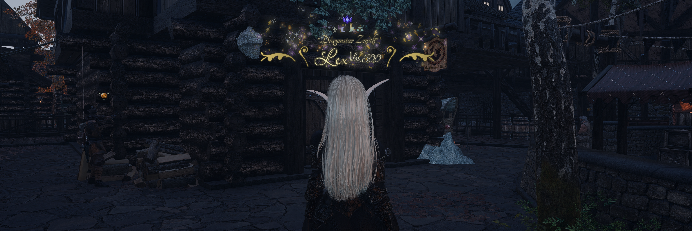
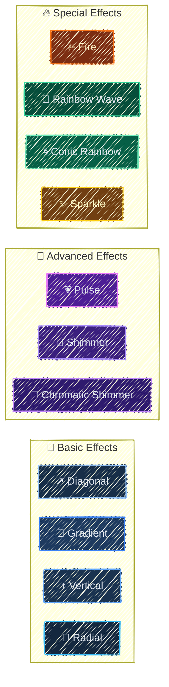
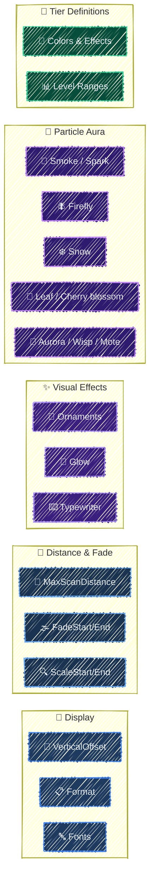
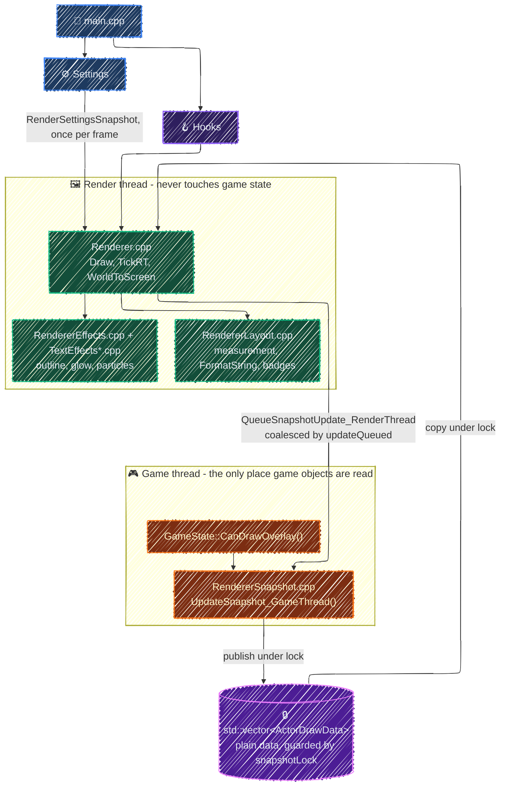

<div align="center">

# glyph
**SKSE overlay for immersive actor nameplates**

📖 [Installation](#installation) | 🎨 [Configuration](#configuration) | 🏗️ [Building](#building) | 🤝 [Contributing](./CONTRIBUTING.md)

![SKSE Plugin](https://img.shields.io/badge/SKSE-Plugin-4f46e5.svg?style=flat&logo=)
![ImGui](https://img.shields.io/badge/ImGui-Overlay-0891b2.svg?style=flat&logo=)
![FreeType](https://img.shields.io/badge/%20-FreeType-4e7e1e.svg?style=flat&logo=)
![CommonLibSSE-NG](https://img.shields.io/badge/CommonLib-SSE_NG-7c3aed.svg?style=flat&logo=)
![Skyrim](https://img.shields.io/badge/Skyrim-SE%20%7C%20AE%20%7C%20GOG-16a34a.svg?style=flat&logo=)

![License](https://img.shields.io/badge/License-MIT-475569.svg?logo=)
<br/>
[](https://sonarcloud.io/summary/new_code?id=lextpf_whois)
[](https://sonarcloud.io/summary/new_code?id=lextpf_whois)
[](https://sonarcloud.io/summary/new_code?id=lextpf_whois)
[](https://app.codacy.com/gh/lextpf/glyph/dashboard?utm_source=gh&utm_medium=referral&utm_content=&utm_campaign=Badge_grade)
<br/>
[](https://github.com/lextpf/glyph/actions/workflows/build.yml)
[](https://github.com/lextpf/glyph/actions/workflows/test.yml)
<br/>
![Sponsor](https://img.shields.io/static/v1?label=sponsor&message=%E2%9D%A4&color=ff69b4&logo=)
</div>

An SKSE plugin that renders **floating nameplates** above NPCs and creatures, displaying *names*, *levels*, and *custom titles*. Features a **tier system** that assigns unique visual styles based on level, from simple gradients to **shimmering rainbows** and **particle auras**. Every aspect is customizable: *fonts*, *colors*, *effects*, *distance fading*, and more.

<div align="center">
<br>



</div>

> [!IMPORTANT]
> One Address Library-powered DLL supports **Skyrim SE 1.5.97** and
> **Skyrim AE 1.6.x on Steam and GOG**. Skyrim VR is not supported.
>
> - Built and tested against **Nolvus Awakening 6.0.20**. `deploy.bat` installs a real MO2 mod
>   folder and updates the profile `modlist.txt`. It defaults to the mods folder
>   `D:\Nolvus\Instance\MODS\mods` and the profile folder
>   `D:\Nolvus\Instance\MODS\profiles\Nolvus Awakening`. Set the environment variables
>   `GLYPH_MO2_MODS` and `GLYPH_MO2_PROFILE` before you run the script to use other folders.
> - If you experience frame drops, type `glyph` in the console to toggle the overlay off.
>   `glyph help` lists the sub-commands: `glyph status`, `glyph nameplates [on|off]`,
>   `glyph plates [on|off]`, and `glyph debug [on|off]` (the performance/cache HUD).
>   Any unambiguous prefix works, for example `s`, `n`, or `d`.

```
/* ============================================================================================== *
 *                                                             ⠀    ⠀⠀⡄⠀⠀⠀⠀⠀⠀⣠⠀⠀⢀⠀⠀⢠⠀⠀⠀
 *                                                             ⠀     ⢸⣧⠀⠀⠀⠀⢠⣾⣇⣀⣴⣿⠀⠀⣼⡇⠀⠀
 *                                                                ⠀⠀⣾⣿⣧⠀⠀⢀⣼⣿⣿⣿⣿⣿⠀⣼⣿⣷⠀⠀
 *                                                                ⠀⢸⣿⣿⣿⡀⠀⠸⠿⠿⣿⣿⣿⡟⢀⣿⣿⣿⡇⠀
 *        ::::::::  :::     :::   ::: :::::::::  :::    :::       ⠀⣾⣿⣿⣿⣿⡀⠀⢀⣼⣿⣿⡿⠁⣿⣿⣿⣿⣷⠀
 *       :+:    :+: :+:     :+:   :+: :+:    :+: :+:    :+:       ⢸⣿⣿⣿⣿⠁⣠⣤⣾⣿⣿⣯⣤⣄⠙⣿⣿⣿⣿⡇
 *       +:+        +:+      +:+ +:+  +:+    +:+ +:+    +:+       ⣿⣿⣿⣿⣿⣶⣿⣿⣿⣿⣿⣿⣿⣿⣶⣿⣿⣿⣿⣿
 *       :#:        +#+       +#++:   +#++:++#+  +#++:++#++       ⠘⢿⣿⣿⣿⣿⣿⣿⣿⣿⣿⣿⣿⣿⣿⣿⣿⣿⣿⡏
 *       +#+   +#+# +#+        +#+    +#+        +#+    +#+       ⠀⠘⢿⣿⣿⣿⠛⠻⢿⣿⣿⣿⠹⠟⣿⣿⣿⣿⣿⠀
 *       #+#    #+# #+#        #+#    #+#        #+#    #+#       ⠀⠀⠘⢿⣿⣿⣦⡄⢸⣿⣿⣿⡇⠠⣿⣿⣿⣿⡇⠀
 *        ########  ########## ###    ###        ###    ###       ⠀⠀⠀⠘⢿⣿⣿⠀⣸⣿⣿⣿⠇⠀⠙⣿⣿⣿⠁⠀
 *                                                                ⠀⠀⠀⠀⠘⣿⠃⢰⣿⣿⣿⡇⠀⠀⠀⠈⢻⡇⠀⠀
 *                                                                ⠀⠀⠀⠀⠀⠈⠀⠈⢿⣿⣿⣿⣶⡶⠂⠀⠀⠁⠀⠀
 *                                << S K Y R I M   P L U G I N >>         ⠀⠀⠈⠻⣿⡿⠋⠀⠀⠀⠀⠀⠀⠀
 *                                                                                                  
 * ============================================================================================== */
```

```
glyph/
|-- src/                                     # Plugin source (C++23)
|   |-- main.cpp                             # SKSEPlugin_Load, lifecycle, message listener
|   |-- Hooks.cpp/hpp                        # D3D11 device, HUDMenu::PostDisplay, Present
|   |-- GameState.cpp/hpp                    # CanDrawOverlay gate (menus, combat, cell)
|   |-- ConsoleCommands.cpp/hpp              # `glyph` console command
|   |-- Renderer.cpp/hpp                     # World-to-screen projection, shared entry
|   |-- RendererSnapshot.cpp                 # Game thread: scan actors, publish snapshot
|   |-- RendererLayout.cpp                   # Render thread: measurement, FormatString, badges
|   |-- RendererEffects.cpp                  # Render thread: outline, glow, particles
|   |-- RendererInternal.hpp                 # Shared render-thread state and types
|   |-- RenderConstants.hpp                  # Compile-time rendering constants
|   |-- RasterQuality.hpp                    # Fixed crisp-layer source quality
|   |-- RenderSampling.cpp/hpp               # Scoped font and badge samplers
|   |-- TextEffects.hpp                      # Public text-effects API
|   |-- TextEffectsCore.cpp                  # Outline/glow infra + vertex capture
|   |-- TextEffectsGradient.cpp              # Static spatial gradients
|   |-- TextEffectsAnimated.cpp              # Time-based per-vertex modulation
|   |-- TextEffectsComplex.cpp               # FBM/noise effects, bloom, soft shadow
|   |-- TextEffectsParticle.cpp              # Particle auras (weather sprites)
|   |-- TextEffectsInternal.hpp              # Shared effect helpers
|   |-- TextPostProcess.cpp/hpp              # Shared post-process passes
|   |-- Graffito.cpp/hpp                     # Actor-aligned world plates (VS + VS CB slot 0)
|   |-- GraffitoMath.hpp                     # Runtime-independent basis/plane/wrap math
|   |-- GraffitoShaderContract.hpp           # CPU/HLSL constant-buffer contract
|   |-- NameFit.hpp                          # Width-driven fit for long names
|   |-- Settings.cpp/hpp                     # INI parsing and configuration
|   |-- SettingsBinding.hpp                  # Declarative kSettings descriptor table
|   |-- ProjectManifest.cpp/hpp              # glyph.project.json asset resolution
|   |-- ParticleTextures.cpp/hpp             # Sprite loading + procedural fallback
|   |-- BadgeTextures.cpp/hpp                # Duotone SVG rasterization for badges
|   |-- Deck.cpp/hpp                         # Offscreen card composition + WIC PNG export
|   |-- DeckPng.cpp/hpp                      # Runtime-independent WIC PNG encoder
|   |-- DeckUtils.cpp/hpp                    # Rarity, crop, pixel, and filename helpers
|   |-- Occlusion.cpp/hpp                    # Line-of-sight culling
|   |-- DepthClip.cpp/hpp                    # Per-pixel depth occlusion
|   |-- SceneMeter.cpp/hpp                   # Candlelight exposure metering
|   |-- HudCompat.cpp/hpp                    # TrueHUD / moreHUD deconfliction
|   |-- TrueHUDAPI.h                         # TrueHUD public API (third-party)
|   |-- DebugOverlay.cpp/hpp                 # Performance/cache debug HUD
|   |-- Utf8Utils.hpp                        # UTF-8 helpers
|   |-- PCH.hpp                              # Precompiled header
|   +-- Version.hpp                          # Plugin version
|-- tests/                                   # GoogleTest suites (pure logic, no game deps)
|   |-- test_settings.cpp
|   |-- test_label_format.cpp
|   |-- test_deck.cpp
|   |-- test_graffito.cpp
|   +-- test_utils.cpp
|-- scripts/                                 # Build & doc helper scripts
|   |-- _normalize_compile_db.py             # clang-cl compile-db fixup
|   |-- _promote_subgroups.py                # doxide doc post-processing
|   +-- _clean_docs.py
|-- glyph.ini                                # Default configuration
|-- glyph.project.json                       # Asset manifest (GUID -> role/token map)
|-- assets/                                  # Runtime assets (deployed as SKSE/Plugins/glyph/)
|   |-- badges/                              # Tier emblem PNGs
|   |-- fonts/                               # Default fonts (not redistributed)
|   |-- particles/                           # Sprite PNGs (not bundled; procedural fallback)
|   +-- duotone/                             # Badge SVGs (not bundled; Font Awesome Pro)
|-- CMakeLists.txt                           # Build configuration
|-- CMakePresets.json                        # CMake presets & toolchain
|-- vcpkg.json                               # vcpkg dependencies
|-- build.bat                                # Format, configure, tidy, build, docs
|-- deploy.bat                               # Package + install as MO2 mod
|-- test.bat                                 # Build & run unit tests
|-- doxide.yml                               # API doc generation config
+-- mkdocs.yml                               # Docs site config
```

## Features

### Visual Effects System


```mermaid
---
config:
  look: handDrawn
  theme: mc
  themeVariables:
    fontSize: 18px
  layout: elk
---
graph LR
    classDef gradient fill:#1e3a5f,stroke:#3b82f6,color:#e2e8f0
    classDef vertical fill:#1a3350,stroke:#60a5fa,color:#e2e8f0
    classDef diagonal fill:#172e48,stroke:#93c5fd,color:#e2e8f0
    classDef radial fill:#14283f,stroke:#38bdf8,color:#e2e8f0
    classDef shimmer fill:#3b1f7e,stroke:#a78bfa,color:#e2e8f0
    classDef chromatic fill:#2e1a6e,stroke:#c084fc,color:#e2e8f0
    classDef pulse fill:#4c1d95,stroke:#e879f9,color:#e2e8f0
    classDef rainbow fill:#064e3b,stroke:#34d399,color:#e2e8f0
    classDef conic fill:#065f46,stroke:#6ee7b7,color:#e2e8f0
    classDef fire fill:#7c2d12,stroke:#f97316,color:#fef3c7
    classDef sparkle fill:#713f12,stroke:#facc15,color:#fef9c3

    subgraph Basic["🎨 Basic Effects"]
        G["🎨 Gradient"]:::gradient
        VG["↕️ Vertical"]:::vertical
        DG["↗️ Diagonal"]:::diagonal
        RG["🔘 Radial"]:::radial
    end

    subgraph Advanced["💎 Advanced Effects"]
        S["💠 Shimmer"]:::shimmer
        CS["🔮 Chromatic Shimmer"]:::chromatic
        P["💗 Pulse"]:::pulse
    end

    subgraph Special["🔥 Special Effects"]
        RW["🌈 Rainbow Wave"]:::rainbow
        CR["🌀 Conic Rainbow"]:::conic
        F["🔥 Fire"]:::fire
        SP["✨ Sparkle"]:::sparkle
    end
```

- **Gradients** - Horizontal, vertical, diagonal, and radial color blending
- **Shimmer** - Moving highlight bands with chromatic aberration option
- **Rainbow** - Animated wave and conic rainbow patterns
- **Fire/Sparkle** - Dynamic elemental effects for legendary tiers

### Tier System

Customizable tiers with unique visual styles per level range. Tier palettes
and effects style the **player** nameplate (and special titles); NPCs render
simple white-leaning text so the world stays readable (see *NPC Colors*).

The bundled `glyph.ini` defines 20 tiers, `[Tier0]` to `[Tier19]`, in 25-level
bands: tier *N* covers levels `25N + 1` to `25N + 25`. `[Tier19]` is the open
top band - its `MaxLevel` is `9999`, so every level above 475 lands there. Each
`[TierN]` block owns its own colors, `NameEffect` / `TitleEffect` / `LevelEffect`,
`ParticleTypes`, `ParticleCount`, and optional `Ornaments`. Both the particle
count and the number of particle types rise up the ladder (`[Tier0]` uses one
type and 6 particles; `[Tier19]` uses six types and 18 particles).

| Section    | Levels  | Name                | Band                          |
|------------|---------|---------------------|-------------------------------|
| `[Tier0]`  | 1-25    | Mossroot            | 🌿 Grounded nature (Tier0-7)  |
| `[Tier1]`  | 26-50   | Sunfern             | 🌿 Grounded nature            |
| `[Tier2]`  | 51-75   | Verdant Thicket     | 🌿 Grounded nature            |
| ...        | ...     | ...                 | ...                           |
| `[Tier7]`  | 176-200 | Abyssroot           | 🌿 Grounded nature            |
| `[Tier8]`  | 201-225 | Tanzanite           | 💎 Gemstone (Tier8-13)        |
| ...        | ...     | ...                 | ...                           |
| `[Tier13]` | 326-350 | Diamond             | 💎 Gemstone                   |
| `[Tier14]` | 351-375 | Sunspire            | 🌌 Celestial (Tier14-19)      |
| ...        | ...     | ...                 | ...                           |
| `[Tier18]` | 451-475 | Auroral Sovereign   | 🌌 Celestial                  |
| `[Tier19]` | 476+    | Dragonstar Zenith   | 🌌 Celestial                  |

The tiers not shown are, in order: Meadowsong, Riverglass, Tideshore, Coralveil
(Tier3-6); Citrine, Emerald, Sapphire, Amethyst (Tier9-12); Halo Seraph,
Starfield, Nebula (Tier15-17).

### ⭐ The Deck

Aim at an NPC and press **F8** to export a collectible character-card PNG.
If no actor is inside the crosshair radius, glyph captures the player instead
when `DeckPlayerFallback` is enabled. Cards are written to
`Data/SKSE/Plugins/glyph/cards` by default. Switch to third-person before
capturing the player so their character model is present in the source frame.

Stable actor facts-level, creature family, and essential status-resolve five
rarities: **Common**, **Uncommon**, **Rare**, **Epic**, and **Legendary**. The
rarity then selects its authored band from glyph's tier ladder, so palettes,
type effects, particles, emblems, and ornaments still come from the existing
tier system. Common cards keep flat typography; a level-50 undead actor or a
dragon receives the aurora-backed holographic Legendary treatment. Unique
named actors also make a configurable rarity pull, so exceptional variants
such as a Legendary Nazeem can actually occur without changing actor stats.

Configure capture in `[Deck]`: `DeckEnabled`, `DeckKey`, `DeckOutputFolder`,
`DeckCardWidth`, `DeckCardHeight`, `DeckTargetRadius`, and
`DeckPlayerFallback`. `DeckRarityRolls` controls unique-character pulls; set it
to `false` for deterministic intrinsic rarity. `DeckKey` uses Win32 virtual-key
codes (`119` is F8).

### Rendering Features

- 🌫️ **Distance-based fading** - Smooth alpha and scale transitions
- 🧱 **Occlusion culling** - Names hidden behind walls
- 🌟 **Glow effects** - Soft bloom for readability
- ⌨️ **Typewriter reveal** - Characters appear one-by-one
- 🌿 **Side ornaments** - Ornate scrollwork for high tiers
- ✨ **Particle auras** - one family of hand-made pixel-art sprites per `ParticleStyle`
  (41 today), assigned by tier:
  - **Weather** - fireflies, snow, smoke, sparks, wisps, leaves, aurora, cherry blossoms, dust, motes
  - **Arcane** - runes, enchant sparkles, hexes, curses, morphing glyphs, gems, glitter, void swirls, vortices, lightning zaps
  - **Sky & nature** - butterflies, fairies, bats, pollen, fog, gusting sand, wind, a moon, a ringed planet, constellations
  - **Whimsy** - bubbles (they pop), coins, confetti, hearts, ink, pixie dust, souls, steam, rising embers, ash, sleepy Zzz's

  Each family moves by one archetype - **orbit** (a tilted 3D ring, front-of-ring sprites drawn larger and brighter), **rise**, **fall**, **flow**, **twinkle**, or **strike**. Many carry 4-frame animation strips (wing flaps, coin spins, twinkles) on a stateless per-particle flipbook clock, and multi-variant families (`smoke`/`smoke2`/`smoke3`) spread their variants evenly across particles.

### Presentation Choreography

- 🎬 **The Roll Call** - When the overlay wakes - combat ends, a menu
  closes, a cell loads, F7 reloads - plates re-enter as a staggered
  near-to-far cascade rather than a simultaneous pop: the innkeeper first,
  the guard on the wall last. `EntranceStaggerStep` / `EntranceStaggerMax`.
- 🤫 **The Quiet Frame** - During fast camera pans, sub-lines (title, info,
  level, badges) fold away and names thin to a low-alpha trace. When the
  camera settles, names resolve first and the sub-lines breathe back in -
  quick to recede, slow and weighty to return. `[Quiet]`.
- ✒️ **Graffito** - NPC typography occupies an upright plane in the world,
  aligned with the actor rather than the camera. Its Folio presentation keeps
  the complete inscription on the front, recesses dark copies of the glyphs
  into shallow physical relief, and collapses side/rear views into a compact
  raised triangle carrying rank, tier-level edges, and relationship-tinted glass.
  During Last Rites the inscription hinges onto the ground as a fallen epitaph.
  Status icons, the rank emblem, and the player's ornaments/particle aura follow
  a non-fisheye world-mark layer, while backplates and badge halos stay out of
  the treatment. `[Graffito]`.
- 🕯️ **Last Rites** - An actor that dies in view earns a one-shot farewell:
  the plate holds still, the ink drains to ash, and the name gutters out and
  sinks (mortals), crumbles letter by letter (draugr), or sears bright before
  going dark (dragons). Corpses first seen dead never get a plate, and rites
  never replay after your own combat. `[DeathRite]`.
- 🗡️ **Cut by the World** - Plates are depth-tested per pixel against the
  game's own depth buffer, so a doorframe physically slices a name as an
  actor steps behind it - no whole-plate popping. Falls back to LOS-only
  occlusion where the depth buffer is unreachable. `[DepthClip]`.
- 🕯️ **Candlelight Metering** - The ink sits in the scene's own light: a
  touch dimmer over bright snowfields, a few percent lifted (with a whisper
  of scene warmth) in torchlit crypts. Capped at +/-8% by default.
  `[Candlelight]`.

### Living Titles & Scene Awareness

- 🏅 **Deeds, Not Words** - `[HonorificN]` sections derive titles from
  faction membership and rank, so "Of the Circle" appears the moment the
  deed is done - on the player *and* on NPC members of the same faction.
  Special titles still take precedence.

  *Keys:* `Faction = 0xFORMID[@Plugin.esp]`, `MinRank`, `Title`, `Priority`,
  `PlayerOnly` / `NpcOnly`.
- 🎚️ **Registers** - `[RegisterN]` sections bind a small knob set to scene
  predicates, so the overlay swells and recedes with the scene over
  `RegisterTransitionTime` seconds - dimmer at night, sparser in a packed city.

  *Knobs:* `AlphaMultiplier`, `FadeDistanceMultiplier`,
  `SubLineAlphaMultiplier`, `HideNeutral`, `Priority`.

  *Predicate:* `When = exterior, night` - tokens `interior`, `exterior`,
  `night`, `day`, `city`, `sneaking`, `dialogue`, `crowded` (`!` negates).
- 🤝 **One Voice Per Actor** - Automatic HUD deconfliction. When TrueHUD
  floats an info/boss bar over an actor, glyph yields that plate (fading to
  `CompatTrueHUDYieldAlpha` and back, synchronized). When moreHUD's crosshair
  readout already shows the target's level, glyph drops its own level segment.
  Absent mods change nothing - zero patching. `[Compat]`.

### Raster Quality

The crisp layer uses targeted source supersampling. Nameplates still render at
the native backbuffer resolution. Fonts rasterize at 1.5 times their layout
density. Status icons use 256-pixel source canvases. Rank emblems use 512-pixel
source canvases. Trilinear sampling uses the font atlas through mip level 3 and
uses the complete badge mip chain. If the 1.5-times font atlas cannot fit in a
D3D11 texture, glyph rebuilds it at the original density.

These fixed values do not change layout, animation, color, or opacity. The glow
pass keeps its half-resolution target. There is no runtime quality setting
because a density change requires a font-atlas rebuild.

## Technology Stack

| Component      | Technology      |
|----------------|-----------------|
| Language       | C++23           |
| Graphics       | D3D11           |
| Overlay        | ImGui           |
| Font Rendering | FreeType 2      |
| Assembly       | xbyak           |
| Framework      | CommonLibSSE-NG |
| Logging        | spdlog          |

## Installation

**Requirements:** Skyrim SE 1.5.97 or AE 1.6.x (Steam/GOG), the matching
[SKSE64](https://skse.silverlock.org/), and the matching
[Address Library for SKSE Plugins](https://www.nexusmods.com/skyrimspecialedition/mods/32444).

`deploy.bat` packages the build into the layout below (or assemble it by
hand), then install the archive with a mod manager:

- **Mod Organizer 2** - install from archive, then enable.
- **Vortex** - drag in the archive, then deploy.

```
Data/SKSE/Plugins/
|-- glyph.dll             # the plugin
|-- glyph.ini             # configuration (hot-reload in-game with F7)
|-- glyph.project.json    # asset manifest (maps roles/tokens -> asset files)
+-- glyph/                # runtime assets
    |-- badges/           # tier emblem PNGs
    |-- duotone/          # status-icon SVGs
    |-- fonts/            # name / level / title / ornament fonts
    +-- particles/        # aura sprite PNGs
```

> **📝 Assets aren't in the repo.** The `glyph/` art (icons, fonts, sprites,
> emblems) is licensed or non-redistributed, so it ships in a release archive
> rather than the source tree. glyph still loads without it - particle
> sprites fall back to procedural rendering - and you can point `IconFolder`,
> `TierBadgeFolder`, and the `*FontPath` keys at your own art.

## Configuration

Edit `Data/SKSE/Plugins/glyph.ini` - press **F7** in-game to hot reload.

`HorizontalOffset` applies a screen-space optical-centering correction to the
complete nameplate (`-10` for the bundled cursive fonts, negative = left). The
offset scales with the nameplate at distance; set it to `0` for fonts that do
not need compensation.

`MaxPlates` caps visible nameplates (the player counts when shown).
`MaxScanActors` bounds the cheap high-process actor scan and is automatically
raised to at least `MaxPlates`. Their defaults are 16 and 128 respectively.

`[Graffito]` replaces camera-facing NPC billboards with perspective-correct,
actor-aligned world planes. `GraffitoScale` controls physical text size,
`GraffitoPlayerScale` uniformly shrinks the complete player plate without
changing its layout proportions,
`GraffitoForwardOffset` keeps the plane ahead of the actor, and
`GraffitoFolioEnabled` selects the relief-front/triangular-facet treatment.
`GraffitoFolioDepth` sets the spacing between relief planes in source pixels
(`2` places them 2, 4, and 6 pixels behind the front, while `0` is a true off
switch);
`GraffitoFolioReverseAlpha` and `GraffitoFolioSpineAlpha` tune the quieter rear
and side facets. `GraffitoWrapDegrees` wraps the readable face around a true
cylindrical arc while keeping its midpoint at the apex;
`GraffitoFisheyeStrength` gives every typography row its own endpoint-pinned
barrel magnification so midpoint glyphs grow while the ends compress, while
icons and rank marks keep their authored proportions on the same crown;
`GraffitoLayerDepth` separates title/info and status marks from the principal name
(it ships at `0`, so the cue is off by default; the useful range is about `0.01`
to `0.06`, which is the clamp ceiling), and
`GraffitoEdgeSheen` adds a restrained highlight only at glancing angles.
Setting a wrap or depth control to `0` disables that cue. With Folio
disabled-or while the inscription
is hinging into its single-sheet epitaph-`GraffitoFacingFadeDegrees`,
`GraffitoBacksideBleedAlpha`, and `GraffitoEdgeSeamAlpha` tune the seam/bleed
treatment. Fallen Epitaph uses the existing Last Rites timing and can be
disabled independently. NPC status icons and rank emblems share the front
depth hierarchy; compact Folio facets carry a restrained rank over
relationship-tinted glass, with raised edges matching the NPC's tier-level
gradient. Use
`GraffitoOrientationSettleTime` to tune turn smoothing and
`GraffitoMaxDistance` to keep the effect local; set `GraffitoEnabled = false`
for the classic billboard presentation.


```mermaid
---
config:
  look: handDrawn
  theme: mc
  themeVariables:
    fontSize: 18px
  layout: elk
---
graph LR
    classDef display fill:#1e3a5f,stroke:#3b82f6,color:#e2e8f0
    classDef distance fill:#1a3350,stroke:#60a5fa,color:#e2e8f0
    classDef effects fill:#3b1f7e,stroke:#a78bfa,color:#e2e8f0
    classDef particles fill:#2e1a6e,stroke:#c084fc,color:#e2e8f0
    classDef tiers fill:#064e3b,stroke:#34d399,color:#e2e8f0

    subgraph Display["📝 Display"]
        FMT["📋 Format"]:::display
        FONT["🔤 Fonts"]:::display
        VERT["📐 VerticalOffset"]:::display
    end

    subgraph Distance["📏 Distance & Fade"]
        FADE["🌫️ FadeStart/End"]:::distance
        SCALE["🔍 ScaleStart/End"]:::distance
        SCAN["📡 MaxScanDistance"]:::distance
    end

    subgraph Effects["✨ Visual Effects"]
        GLOW["🌟 Glow"]:::effects
        TYPE["⌨️ Typewriter"]:::effects
        ORNA["🌿 Ornaments"]:::effects
    end

    subgraph Particles["💫 Particle Aura"]
        FIREFLY["🪰 Firefly"]:::particles
        SNOW["❄️ Snow"]:::particles
        SMOKE["💨 Smoke / Spark"]:::particles
        FLORA["🍃 Leaf / Cherry blossom"]:::particles
        AURORA["🌌 Aurora / Wisp / Mote"]:::particles
    end

    subgraph Tiers["🏅 Tier Definitions"]
        TIER["🎨 Colors & Effects"]:::tiers
        LEVEL["📊 Level Ranges"]:::tiers
    end

```

### 🎨 NPC Colors

NPC name fill stays white. Title and level text reuse the same tier-level
gradient that the player receives for that level band, without enabling
ordinary NPC tier animation. The NPC color settings now tint supporting
outlines/shadows so relationship information remains restrained.

| Setting            | Default            | Applies to                       |
|--------------------|--------------------|----------------------------------|
| `NpcNeutralColor`  | `1.0, 1.0, 1.0`    | ⚪ Neutral name support tint     |
| `NpcHostileColor`  | `1.0, 0.86, 0.84`  | 🔴 Hostile name support tint     |
| `NpcFollowerColor` | `0.86, 0.91, 1.0`  | 🔵 Follower name support tint    |
| `NpcLevelColor`    | `0.80, 0.82, 0.86` | 🩶 Level support tint            |
| `NpcTitleColor`    | `0.92, 0.93, 0.95` | ⬜ Title support tint            |

### 🏷️ Status Icon Badges

Relationship, threat, and creature type render as a compact strip of icons
above the name (replacing the old text info row).
Icons are [Font Awesome](https://fontawesome.com/) **duotone SVGs**
rasterized at load time (via nanosvg) from `IconFolder`: each `Icon*`
value is an SVG file name without the extension, so any icon dropped into
the folder works. Duotone layer opacities are preserved, and the badge's
semantic color is applied as a tint.

> **📝 Note:** the duotone icon set used during development is Font Awesome
> Pro and is **not** part of this repository. Point `IconFolder` at any
> folder of FA-style SVGs (Font Awesome Free's duotone-compatible SVG
> downloads work too).

**⚙️ Badge settings**

```ini
[Icons]
IconFolder      = Data/SKSE/Plugins/glyph/duotone
IconsEnabled    = true
IconScale       = 0.8         ; badge size relative to the level font
IconDeadlyPulse = true        ; subtle pulse on the Deadly skull
IconOpacity     = 0.92        ; status-row opacity multiplier, 0.5-2.0
IconMutedAlpha  = 1.0         ; optional resting-state multiplier, 0.0-1.0
```

`IconOpacity` affects active and resting status icons. Resting icons use the same
alpha by default. Set `IconMutedAlpha` below `1.0` to dim only resting icons.

**🧩 NPC badge icons** render left-to-right - rank, relationship, creature,
role, protection, threat, then engagement. The rank follows the same level
ladder as the player's badge, but does not enable tier typography or tier
effects for ordinary NPCs. Leave any value empty to hide that badge.

| Category        | Setting        | Default icon       | Tint             |
|-----------------|----------------|--------------------|------------------|
| 🤝 Relationship | `IconFollower` | `shield-halved`    | 🔵 Light blue    |
| 🤝 Relationship | `IconAlly`     | `handshake`        | 🟢 Green         |
| 🤝 Relationship | `IconHostile`  | `skull-crossbones` | 🔴 Red           |
| ⚔️ Threat       | `IconWeak`     | `caret-down`       | 🩶 Gray          |
| ⚔️ Threat       | `IconStrong`   | `caret-up`         | 🟠 Orange        |
| ⚔️ Threat       | `IconDeadly`   | `skull`            | 🔴 Red (pulsing) |
| 🐾 Creature     | `IconBeast`    | `paw`              | 🟡 Warm tan      |
| 🐾 Creature     | `IconUndead`   | `ghost`            | 🟡 Warm tan      |
| 🐾 Creature     | `IconDaedra`   | `fire`             | 🟡 Warm tan      |
| 🐾 Creature     | `IconDragon`   | `dragon`           | 🟡 Warm tan      |

Each badge takes an `R,G,B` float color: `IconFollowerColor`,
`IconAllyColor`, `IconHostileColor`, `IconWeakColor`, `IconStrongColor`,
`IconDeadlyColor`, and one shared `IconCreatureColor` for all creature
types.

**👑 Rank and player row** - every actor gets a rank badge. The player's strip
shows five slots, left to right: **tier prestige**, sneak, engagement,
encumbered, and bounty. The prestige
badge tracks the `[TierN]` ladder and is always lit - `IconTierLow` (`medal`,
bronze), `IconTierMid` (`gem`, silver-blue), `IconTierHigh` (`crown`, gold)
for the low / mid / high third. Toggle with `IconTierEnabled`; recolor with
`IconTierLowColor` / `IconTierMidColor` / `IconTierHighColor`.

📜 The legacy text row is still available: set `InfoFormat` explicitly
(e.g. `InfoFormat = "%r?","  • %d?","  • %c?"`) and it renders as before.

## Building

### Prerequisites

- CMake 3.21+ (`CMakeLists.txt` requires 3.19; `CMakePresets.json` is schema v3 and
  declares `cmakeMinimumRequired` 3.21, which the documented `--preset` workflow needs)
- C++23 compatible compiler (MSVC 2022+)
- MSVC v143 toolset **14.44.35207** - pinned in `CMakePresets.json`; configure fails without it
- vcpkg
- `VCPKG_ROOT` set to your vcpkg checkout - every preset resolves its toolchain file
  through this variable, and `CMakeLists.txt` reads it for include paths
- Skyrim SE 1.5.97 or AE 1.6.x (Steam/GOG)
- SKSE64
- Address Library for SKSE Plugins

### Windows

```powershell
# 1. Clone the repository
git clone https://github.com/lextpf/glyph.git
cd glyph

# 2. Build
.\build.bat

# 3. Deploy to Skyrim as an MO2 mod
#    Set GLYPH_MO2_MODS and GLYPH_MO2_PROFILE first if your MO2 folders differ
#    from the D:\Nolvus\Instance\MODS defaults.
.\deploy.bat
```

Output: `build/Release/glyph.dll`

## Architecture


```mermaid
---
config:
  look: handDrawn
  theme: mc
  themeVariables:
    fontSize: 18px
  layout: elk
---
graph TB
    classDef core fill:#1e3a5f,stroke:#3b82f6,color:#e2e8f0
    classDef hook fill:#2e1f5e,stroke:#8b5cf6,color:#e2e8f0
    classDef game fill:#7c2d12,stroke:#f97316,color:#fef3c7
    classDef render fill:#134e3a,stroke:#10b981,color:#e2e8f0
    classDef data fill:#4c1d95,stroke:#e879f9,color:#e2e8f0

    Main["🚀 main.cpp"]:::core
    Settings["⚙️ Settings"]:::core
    Hooks["🪝 Hooks"]:::hook

    subgraph GameThread["🎮 Game thread - the only place game objects are read"]
        Gate["GameState::CanDrawOverlay()"]:::game
        Snap["RendererSnapshot.cpp<br/>UpdateSnapshot_GameThread()"]:::game
    end

    Data[("🔒 std::vector&lt;ActorDrawData&gt;<br/>plain data, guarded by snapshotLock")]:::data

    subgraph RenderThread["🖼️ Render thread - never touches game state"]
        Frame["Renderer.cpp<br/>Draw, TickRT, WorldToScreen"]:::render
        Layout["RendererLayout.cpp<br/>measurement, FormatString, badges"]:::render
        Effects["RendererEffects.cpp + TextEffects*.cpp<br/>outline, glow, particles"]:::render
    end

    Main --> Settings
    Main --> Hooks
    Hooks --> Frame
    Gate --> Snap
    Snap -- "publish under lock" --> Data
    Data -- "copy under lock" --> Frame
    Frame --> Layout
    Frame --> Effects
    Frame -- "QueueSnapshotUpdate_RenderThread<br/>coalesced by updateQueued" --> Snap
    Settings -- "RenderSettingsSnapshot, once per frame" --> Frame
```

The producer/consumer split above is the central invariant: the game thread
resolves actors and publishes plain data, and the render thread only projects,
lays out, and draws it. A name suffixed `_GameThread`, `_RenderThread`, or `RT`
states the affinity of that function.

| Subsystem       | Files                                                                                                     | Purpose                                                        |
|-----------------|-----------------------------------------------------------------------------------------------------------|----------------------------------------------------------------|
| Entry point     | `main.cpp`, `Version.hpp`, `PCH.hpp`                                                                        | SKSE load, lifecycle, message listener                         |
| Engine hooks    | `Hooks.cpp/hpp`                                                                                             | D3D11 device creation, `HUDMenu::PostDisplay`, `Present`       |
| Gating          | `GameState.cpp/hpp`, `ConsoleCommands.cpp/hpp`                                                              | `CanDrawOverlay` gate; the `glyph` console command             |
| Renderer        | `Renderer.cpp/hpp`, `RendererSnapshot.cpp`, `RendererLayout.cpp`, `RendererEffects.cpp`, `RendererInternal.hpp` | Snapshot publish, projection, layout, per-effect dispatch  |
| Text effects    | `TextEffectsCore.cpp`, `TextEffectsGradient.cpp`, `TextEffectsAnimated.cpp`, `TextEffectsComplex.cpp`, `TextEffectsParticle.cpp` | Visual effect implementations; `TextEffects.hpp` is the shared API   |
| GPU passes      | `TextPostProcess.cpp/hpp`, `Graffito.cpp/hpp`, `DepthClip.cpp/hpp`, `SceneMeter.cpp/hpp`                     | Glow/divide capture, world plates, depth clip, scene metering  |
| Assets          | `ParticleTextures.cpp/hpp`, `BadgeTextures.cpp/hpp`, `ProjectManifest.cpp/hpp`                               | Sprite and SVG loading, `glyph.project.json` resolution        |
| Configuration   | `Settings.cpp/hpp`, `SettingsBinding.hpp`                                                                   | INI parsing, the `kSettings` descriptor table, hot reload      |
| Cards           | `Deck.cpp/hpp`, `DeckPng.cpp/hpp`, `DeckUtils.cpp/hpp`                                                       | Offscreen card composition and WIC PNG export                  |
| Visibility      | `Occlusion.cpp/hpp`, `HudCompat.cpp/hpp`, `DebugOverlay.cpp/hpp`                                             | Line-of-sight culling, TrueHUD/moreHUD yield, debug HUD        |

## Troubleshooting

|            Problem | Solution                                           |
|--------------------|----------------------------------------------------|
| Names don't appear | Check SKSE is loaded (`getskseversion` in console) |
| No names in combat | Intended behavior - overlay disabled during combat |
| Performance issues | Reduce `MaxPlates`, `MaxScanActors`, or `MaxScanDistance`; disable complex effects |
|  Fonts not loading | Verify paths in INI, ensure TTF format             |

Check `Documents/My Games/Skyrim Special Edition/SKSE/glyph.log` for errors.

## Contributing

Contributions are welcome! Please read the [Contributing Guidelines](CONTRIBUTING.md) before submitting pull requests.

### Development Workflow

1. Fork the repository
2. Create a feature branch (`git checkout -b feature/amazing-feature`)
3. Make your changes
4. Run `.\test.bat` and ensure the build passes
5. Commit with descriptive messages
6. Push to your fork and open a Pull Request

## License

This project is licensed under the MIT License - see the [LICENSE](LICENSE.md) file for details.

## Acknowledgments

- [SKSE Team](https://skse.silverlock.org/) - Script extender framework
- [CommonLibSSE-NG](https://github.com/CharmedBaryon/CommonLibSSE-NG) - SKSE plugin library
- [ImGui](https://github.com/ocornut/imgui) - Immediate mode GUI
- [FreeType](https://freetype.org/) - Font rendering
- [spdlog](https://github.com/gabime/spdlog) - Logging library
- [xbyak](https://github.com/herumi/xbyak) - JIT assembler
- [Claude](https://claude.ai/) - AI coding assistant by Anthropic
- [Codex](https://openai.com/index/openai-codex/) - AI coding assistant by OpenAI
- [Sora](https://openai.com/sora/) - Graphics generation
- [Font Awesome](https://fontawesome.com/) - Status badge icon artwork (duotone SVGs; Pro assets are not redistributed with this project)
- [NanoSVG](https://github.com/memononen/nanosvg) - SVG parsing and rasterization for badge icons


