<div align="center">

# whois
**SKSE overlay for actor info and appearance templates**

📖 [Installation](#installation) | 🎨 [Configuration](#configuration) | 🏗️ [Building](#building) | 🤝 [Contributing](./CONTRIBUTING.md)

![SKSE Plugin](https://img.shields.io/badge/Skse-Plugin-4f46e5.svg?style=flat&logo=data:image/svg+xml;base64,PHN2ZyB3aWR0aD0iMTI4cHgiIGhlaWdodD0iMTI4cHgiIHZpZXdCb3g9IjAgMCAyNCAyNCIgZmlsbD0ibm9uZSIgeG1sbnM9Imh0dHA6Ly93d3cudzMub3JnLzIwMDAvc3ZnIiBzdHJva2U9IiNmZmZmZmYiPjxnIGlkPSJTVkdSZXBvX2JnQ2FycmllciIgc3Ryb2tlLXdpZHRoPSIwIj48L2c+PGcgaWQ9IlNWR1JlcG9fdHJhY2VyQ2FycmllciIgc3Ryb2tlLWxpbmVjYXA9InJvdW5kIiBzdHJva2UtbGluZWpvaW49InJvdW5kIj48L2c+PGcgaWQ9IlNWR1JlcG9faWNvbkNhcnJpZXIiPiA8cGF0aCBmaWxsLXJ1bGU9ImV2ZW5vZGQiIGNsaXAtcnVsZT0iZXZlbm9kZCIgZD0iTTEyIDJWN0wxMiA3LjA1NDQxQzExLjk5OTkgNy40Nzg0OCAxMS45OTk4IDcuODkwNiAxMi4wNDU1IDguMjMwNTJDMTIuMDk3IDguNjEzNzIgMTIuMjIyNiA5LjA1MSAxMi41ODU4IDkuNDE0MjFDMTIuOTQ5IDkuNzc3NDMgMTMuMzg2MyA5LjkwMjk1IDEzLjc2OTUgOS45NTQ0N0MxNC4xMDk0IDEwLjAwMDIgMTQuNTIxNSAxMC4wMDAxIDE0Ljk0NTYgMTBIMTQuOTQ1NkgxNC45NDU2SDE0Ljk0NTZMMTUgMTBIMjBWMTZDMjAgMTguODI4NCAyMCAyMC4yNDI2IDE5LjEyMTMgMjEuMTIxM0MxOC4yNDI2IDIyIDE2LjgyODQgMjIgMTQgMjJIMTBDNy4xNzE1NyAyMiA1Ljc1NzM2IDIyIDQuODc4NjggMjEuMTIxM0M0IDIwLjI0MjYgNCAxOC44Mjg0IDQgMTZWOEM0IDUuMTcxNTcgNCAzLjc1NzM2IDQuODc4NjggMi44Nzg2OEM1Ljc1NzM2IDIgNy4xNzE1NyAyIDEwIDJIMTJaTTE0IDIuMDA0NjJWN0MxNCA3LjQ5OTY3IDE0LjAwMjEgNy43NzM4MyAxNC4wMjc3IDcuOTY0MDJMMTQuMDI4NyA3Ljk3MTMxTDE0LjAzNiA3Ljk3MjMxQzE0LjIyNjIgNy45OTc4OCAxNC41MDAzIDggMTUgOEgxOS45OTU0QzE5Ljk4NTIgNy41ODgzNiAxOS45NTI1IDcuMzE1OTUgMTkuODQ3OCA3LjA2MzA2QzE5LjY5NTUgNi42OTU1MiAxOS40MDY1IDYuNDA2NDkgMTguODI4NCA1LjgyODQzTDE2LjE3MTYgMy4xNzE1N0MxNS41OTM1IDIuNTkzNTEgMTUuMzA0NSAyLjMwNDQ4IDE0LjkzNjkgMi4xNTIyNEMxNC42ODQgMi4wNDc0OSAxNC40MTE2IDIuMDE0ODEgMTQgMi4wMDQ2MlpNOCAxM0M4IDEyLjQ0NzcgOC40NDc3MiAxMiA5IDEyTDE1IDEyQzE1LjU1MjMgMTIgMTYgMTIuNDQ3NyAxNiAxM0MxNiAxMy41NTIzIDE1LjU1MjMgMTQgMTUgMTRMOSAxNEM4LjQ0NzcyIDE0IDggMTMuNTUyMyA4IDEzWk05IDE2QzguNDQ3NzIgMTYgOCAxNi40NDc3IDggMTdDOCAxNy41NTIzIDguNDQ3NzIgMTggOSAxOEgxM0MxMy41NTIzIDE4IDE0IDE3LjU1MjMgMTQgMTdDMTQgMTYuNDQ3NyAxMy41NTIzIDE2IDEzIDE2SDlaIiBmaWxsPSIjZmZmZmZmIj48L3BhdGg+IDwvZz48L3N2Zz4=)
![ImGui](https://img.shields.io/badge/ImGui-Overlay-0891b2.svg?style=flat&logo=data:image/svg+xml;base64,PHN2ZyBmaWxsPSIjZmZmZmZmIiB2ZXJzaW9uPSIxLjEiIHhtbG5zPSJodHRwOi8vd3d3LnczLm9yZy8yMDAwL3N2ZyIgeG1sbnM6eGxpbms9Imh0dHA6Ly93d3cudzMub3JnLzE5OTkveGxpbmsiIHdpZHRoPSIxMjhweCIgaGVpZ2h0PSIxMjhweCIgdmlld0JveD0iMCAwIDI4LjE1MiAyNS42ODMiIHhtbDpzcGFjZT0icHJlc2VydmUiIHN0cm9rZT0iI2ZmZmZmZiI+PGcgaWQ9IlNWR1JlcG9fYmdDYXJyaWVyIiBzdHJva2Utd2lkdGg9IjAiPjwvZz48ZyBpZD0iU1ZHUmVwb190cmFjZXJDYXJyaWVyIiBzdHJva2UtbGluZWNhcD0icm91bmQiIHN0cm9rZS1saW5lam9pbj0icm91bmQiPjwvZz48ZyBpZD0iU1ZHUmVwb19pY29uQ2FycmllciI+IDxnIGlkPSJvdmVybGF5Ij4gPHBhdGggZD0iTTEwLjYwNSwxNi45MzdjLTIuODI2LTEuMDktNS4wMTQtMy40NjMtNS44NDUtNi40MDZDMS45NiwxMS43NDUsMCwxNC41MzIsMCwxNy43NzljMCw0LjM2NiwzLjUzOCw3LjkwMyw3LjkwNCw3LjkwMyBjMS44NTQsMCwzLjU1Ni0wLjY0Myw0LjkwNC0xLjcxMmMtMS40LTEuNjgtMi4yNDYtMy44MzktMi4yNDYtNi4xOTFDMTAuNTYzLDE3LjQ5NSwxMC41ODEsMTcuMjE1LDEwLjYwNSwxNi45Mzd6Ij48L3BhdGg+IDxwYXRoIGQ9Ik0yMy4zOTIsMTAuNTI5Yy0xLjE0OCw0LjA2Ny00Ljg4NCw3LjA2Mi05LjMxNSw3LjA2MmMtMC41ODUsMC0xLjE1NC0wLjA2MS0xLjcxMi0wLjE2MSBjLTAuMDA2LDAuMTE3LTAuMDE4LDAuMjMxLTAuMDE4LDAuMzVjMCw0LjM2NiwzLjUzNyw3LjkwMyw3LjkwMyw3LjkwM2M0LjM2NCwwLDcuOTAyLTMuNTM3LDcuOTAyLTcuOTAzIEMyOC4xNTIsMTQuNTMyLDI2LjE5MiwxMS43NDUsMjMuMzkyLDEwLjUyOXoiPjwvcGF0aD4gPGNpcmNsZSBjeD0iMTQuMDc2IiBjeT0iNy45MDMiIHI9IjcuOTAzIj48L2NpcmNsZT4gPC9nPiA8ZyBpZD0iTGF5ZXJfMSI+IDwvZz4gPC9nPjwvc3ZnPg==)
![CommonLibSSE-NG](https://img.shields.io/badge/CommonLib-SSE%20NG-7c3aed.svg?style=flat&logo=data:image/svg+xml;base64,PHN2ZyB3aWR0aD0iMTY0cHgiIGhlaWdodD0iMTY0cHgiIHZpZXdCb3g9IjAgMCAyOC4wMCAyOC4wMCIgdmVyc2lvbj0iMS4xIiB4bWxucz0iaHR0cDovL3d3dy53My5vcmcvMjAwMC9zdmciIHhtbG5zOnhsaW5rPSJodHRwOi8vd3d3LnczLm9yZy8xOTk5L3hsaW5rIiBmaWxsPSIjZmZmZmZmIiBzdHJva2U9IiNmZmZmZmYiPjxnIGlkPSJTVkdSZXBvX2JnQ2FycmllciIgc3Ryb2tlLXdpZHRoPSIwIj48L2c+PGcgaWQ9IlNWR1JlcG9fdHJhY2VyQ2FycmllciIgc3Ryb2tlLWxpbmVjYXA9InJvdW5kIiBzdHJva2UtbGluZWpvaW49InJvdW5kIiBzdHJva2U9IiNDQ0NDQ0MiIHN0cm9rZS13aWR0aD0iMC4yMjQwMDAwMDAwMDAwMDAwMyI+PC9nPjxnIGlkPSJTVkdSZXBvX2ljb25DYXJyaWVyIj4gPCEtLSBVcGxvYWRlZCB0bzogU1ZHIFJlcG8sIHd3dy5zdmdyZXBvLmNvbSwgR2VuZXJhdG9yOiBTVkcgUmVwbyBNaXhlciBUb29scyAtLT4gPHRpdGxlPmljX2ZsdWVudF9saWJyYXJ5XzI4X2ZpbGxlZDwvdGl0bGU+IDxkZXNjPkNyZWF0ZWQgd2l0aCBTa2V0Y2guPC9kZXNjPiA8ZyBpZD0i8J+UjS1Qcm9kdWN0LUljb25zIiBzdHJva2Utd2lkdGg9IjAuMDAwMjgiIGZpbGw9Im5vbmUiIGZpbGwtcnVsZT0iZXZlbm9kZCI+IDxnIGlkPSJpY19mbHVlbnRfbGlicmFyeV8yOF9maWxsZWQiIGZpbGw9IiNmZmZmZmYiIGZpbGwtcnVsZT0ibm9uemVybyI+IDxwYXRoIGQ9Ik01Ljk4OTcsMyBDNy4wOTM3LDMgNy45ODk3LDMuODk2IDcuOTg5Nyw1IEw3Ljk4OTcsMjMgQzcuOTg5NywyNC4xMDQgNy4wOTM3LDI1IDUuOTg5NywyNSBMNC4wMDA3LDI1IEMyLjg5NTcsMjUgMi4wMDA3LDI0LjEwNCAyLjAwMDcsMjMgTDIuMDAwNyw1IEMyLjAwMDcsMy44OTYgMi44OTU3LDMgNC4wMDA3LDMgTDUuOTg5NywzIFogTTEyLjk4OTcsMyBDMTQuMDkzNywzIDE0Ljk4OTcsMy44OTYgMTQuOTg5Nyw1IEwxNC45ODk3LDIzIEMxNC45ODk3LDI0LjEwNCAxNC4wOTM3LDI1IDEyLjk4OTcsMjUgTDEwLjk5NDcsMjUgQzkuODg5NywyNSA4Ljk5NDcsMjQuMTA0IDguOTk0NywyMyBMOC45OTQ3LDUgQzguOTk0NywzLjg5NiA5Ljg4OTcsMyAxMC45OTQ3LDMgTDEyLjk4OTcsMyBaIE0yMi4wNzAxLDYuNTQzMiBMMjUuOTMwMSwyMi4wMjYyIEMyNi4xOTcxLDIzLjA5NzIgMjUuNTQ0MSwyNC4xODMyIDI0LjQ3MzEsMjQuNDUxMiBMMjIuNTEwMSwyNC45NDAyIEMyMS40MzkxLDI1LjIwNzIgMjAuMzUzMSwyNC41NTUyIDIwLjA4NjEsMjMuNDgzMiBMMTYuMjI2MSw4LjAwMDIgQzE1Ljk1ODEsNi45MjgyIDE2LjYxMTEsNS44NDMyIDE3LjY4MjEsNS41NzUyIEwxOS42NDUxLDUuMDg2MiBDMjAuNzE2MSw0LjgxODIgMjEuODAyMSw1LjQ3MTIgMjIuMDcwMSw2LjU0MzIgWiIgaWQ9IvCfjqgtQ29sb3IiPiA8L3BhdGg+IDwvZz4gPC9nPiA8L2c+PC9zdmc+)
![Skyrim](https://img.shields.io/badge/Skyrim-SE%201.5.97-16a34a.svg?style=flat&logo=data:image/svg+xml;base64,PHN2ZyBmaWxsPSIjZmZmZmZmIiB3aWR0aD0iMTI4cHgiIGhlaWdodD0iMTI4cHgiIHZpZXdCb3g9IjAgLTY0IDY0MCA2NDAiIHhtbG5zPSJodHRwOi8vd3d3LnczLm9yZy8yMDAwL3N2ZyIgc3Ryb2tlPSIjZmZmZmZmIj48ZyBpZD0iU1ZHUmVwb19iZ0NhcnJpZXIiIHN0cm9rZS13aWR0aD0iMCI+PC9nPjxnIGlkPSJTVkdSZXBvX3RyYWNlckNhcnJpZXIiIHN0cm9rZS1saW5lY2FwPSJyb3VuZCIgc3Ryb2tlLWxpbmVqb2luPSJyb3VuZCI+PC9nPjxnIGlkPSJTVkdSZXBvX2ljb25DYXJyaWVyIj48cGF0aCBkPSJNMTguMzIgMjU1Ljc4TDE5MiAyMjMuOTZsLTkxLjI4IDY4LjY5Yy0xMC4wOCAxMC4wOC0yLjk0IDI3LjMxIDExLjMxIDI3LjMxaDIyMi43Yy05LjQ0LTI2LjQtMTQuNzMtNTQuNDctMTQuNzMtODMuMzh2LTQyLjI3bC0xMTkuNzMtODcuNmMtMjMuODItMTUuODgtNTUuMjktMTQuMDEtNzcuMDYgNC41OUw1LjgxIDIyNy42NGMtMTIuMzggMTAuMzMtMy40NSAzMC40MiAxMi41MSAyOC4xNHptNTU2Ljg3IDM0LjFsLTEwMC42Ni01MC4zMUE0Ny45OTIgNDcuOTkyIDAgMCAxIDQ0OCAxOTYuNjV2LTM2LjY5aDY0bDI4LjA5IDIyLjYzYzYgNiAxNC4xNCA5LjM3IDIyLjYzIDkuMzdoMzAuOTdhMzIgMzIgMCAwIDAgMjguNjItMTcuNjlsMTQuMzEtMjguNjJhMzIuMDA1IDMyLjAwNSAwIDAgMC0zLjAyLTMzLjUxbC03NC41My05OS4zOEM1NTMuMDIgNC43IDU0My41NCAwIDUzMy40NyAwSDI5Ni4wMmMtNy4xMyAwLTEwLjcgOC41Ny01LjY2IDEzLjYxTDM1MiA2My45NiAyOTIuNDIgODguOGMtNS45IDIuOTUtNS45IDExLjM2IDAgMTQuMzFMMzUyIDEyNy45NnYxMDguNjJjMCA3Mi4wOCAzNi4wMyAxMzkuMzkgOTYgMTc5LjM4LTE5NS41OSA2LjgxLTM0NC41NiA0MS4wMS00MzQuMSA2MC45MUM1Ljc4IDQ3OC42NyAwIDQ4NS44OCAwIDQ5NC4yIDAgNTA0IDcuOTUgNTEyIDE3Ljc2IDUxMmg0OTkuMDhjNjMuMjkuMDEgMTE5LjYxLTQ3LjU2IDEyMi45OS0xMTAuNzYgMi41Mi00Ny4yOC0yMi43My05MC40LTY0LjY0LTExMS4zNnpNNDg5LjE4IDY2LjI1bDQ1LjY1IDExLjQxYy0yLjc1IDEwLjkxLTEyLjQ3IDE4Ljg5LTI0LjEzIDE4LjI2LTEyLjk2LS43MS0yNS44NS0xMi41My0yMS41Mi0yOS42N3oiPjwvcGF0aD48L2c+PC9zdmc+)

![License](https://img.shields.io/badge/License-MIT-475569.svg?logo=data:image/svg+xml;base64,PHN2ZyBmaWxsPSIjZmZmZmZmIiB3aWR0aD0iMTY0cHgiIGhlaWdodD0iMTY0cHgiIHZpZXdCb3g9IjAgMCA1MTIuMDAgNTEyLjAwIiB4bWxucz0iaHR0cDovL3d3dy53My5vcmcvMjAwMC9zdmciIHN0cm9rZT0iI2ZmZmZmZiIgc3Ryb2tlLXdpZHRoPSIwLjAwNTEyIj48ZyBpZD0iU1ZHUmVwb19iZ0NhcnJpZXIiIHN0cm9rZS13aWR0aD0iMCI+PC9nPjxnIGlkPSJTVkdSZXBvX3RyYWNlckNhcnJpZXIiIHN0cm9rZS1saW5lY2FwPSJyb3VuZCIgc3Ryb2tlLWxpbmVqb2luPSJyb3VuZCIgc3Ryb2tlPSIjQ0NDQ0NDIiBzdHJva2Utd2lkdGg9IjMuMDcyIj48L2c+PGcgaWQ9IlNWR1JlcG9faWNvbkNhcnJpZXIiPjxwYXRoIGQ9Ik0yNTYgOEMxMTkuMDMzIDggOCAxMTkuMDMzIDggMjU2czExMS4wMzMgMjQ4IDI0OCAyNDggMjQ4LTExMS4wMzMgMjQ4LTI0OFMzOTIuOTY3IDggMjU2IDh6bTExNy4xMzQgMzQ2Ljc1M2MtMS41OTIgMS44NjctMzkuNzc2IDQ1LjczMS0xMDkuODUxIDQ1LjczMS04NC42OTIgMC0xNDQuNDg0LTYzLjI2LTE0NC40ODQtMTQ1LjU2NyAwLTgxLjMwMyA2Mi4wMDQtMTQzLjQwMSAxNDMuNzYyLTE0My40MDEgNjYuOTU3IDAgMTAxLjk2NSAzNy4zMTUgMTAzLjQyMiAzOC45MDRhMTIgMTIgMCAwIDEgMS4yMzggMTQuNjIzbC0yMi4zOCAzNC42NTVjLTQuMDQ5IDYuMjY3LTEyLjc3NCA3LjM1MS0xOC4yMzQgMi4yOTUtLjIzMy0uMjE0LTI2LjUyOS0yMy44OC02MS44OC0yMy44OC00Ni4xMTYgMC03My45MTYgMzMuNTc1LTczLjkxNiA3Ni4wODIgMCAzOS42MDIgMjUuNTE0IDc5LjY5MiA3NC4yNzcgNzkuNjkyIDM4LjY5NyAwIDY1LjI4LTI4LjMzOCA2NS41NDQtMjguNjI1IDUuMTMyLTUuNTY1IDE0LjA1OS01LjAzMyAxOC41MDggMS4wNTNsMjQuNTQ3IDMzLjU3MmExMi4wMDEgMTIuMDAxIDAgMCAxLS41NTMgMTQuODY2eiI+PC9wYXRoPjwvZz48L3N2Zz4=)
<br/>
[](https://sonarcloud.io/summary/new_code?id=lextpf_whois)
[](https://sonarcloud.io/summary/new_code?id=lextpf_whois)
[](https://sonarcloud.io/summary/new_code?id=lextpf_whois)
<br/>
[](https://github.com/lextpf/whois/actions/workflows/build.yml)
[](https://github.com/lextpf/whois/actions/workflows/test.yml)
<br/>
![Sponsor](https://img.shields.io/static/v1?label=sponsor&message=%E2%9D%A4&color=ff69b4&logo=data:image/svg+xml;base64,PHN2ZyB2ZXJzaW9uPSIxLjEiIGlkPSJMYXllcl8xIiB4bWxucz0iaHR0cDovL3d3dy53My5vcmcvMjAwMC9zdmciIHhtbG5zOnhsaW5rPSJodHRwOi8vd3d3LnczLm9yZy8xOTk5L3hsaW5rIiB2aWV3Qm94PSIwIDAgNTEyLjAwIDUxMi4wMCIgeG1sOnNwYWNlPSJwcmVzZXJ2ZSIgd2lkdGg9IjE2OHB4IiBoZWlnaHQ9IjE2OHB4IiBmaWxsPSIjMDAwMDAwIiBzdHJva2U9IiMwMDAwMDAiIHN0cm9rZS13aWR0aD0iMC4wMDUxMiI+PGcgaWQ9IlNWR1JlcG9fYmdDYXJyaWVyIiBzdHJva2Utd2lkdGg9IjAiPjwvZz48ZyBpZD0iU1ZHUmVwb190cmFjZXJDYXJyaWVyIiBzdHJva2UtbGluZWNhcD0icm91bmQiIHN0cm9rZS1saW5lam9pbj0icm91bmQiIHN0cm9rZT0iI0NDQ0NDQyIgc3Ryb2tlLXdpZHRoPSIxLjAyNCI+PC9nPjxnIGlkPSJTVkdSZXBvX2ljb25DYXJyaWVyIj4gPHJlY3QgeD0iMjMzLjQxMiIgeT0iNzUuMjk0IiBzdHlsZT0iZmlsbDojMUUyRTNCOyIgd2lkdGg9IjQ1LjE3NiIgaGVpZ2h0PSIzMDEuMTc2Ij48L3JlY3Q+IDxjaXJjbGUgc3R5bGU9ImZpbGw6Izc4QjlFQjsiIGN4PSIyNTYiIGN5PSI0NS4xNzYiIHI9IjQ1LjE3NiI+PC9jaXJjbGU+IDxwYXRoIHN0eWxlPSJmaWxsOiM1QThCQjA7IiBkPSJNMjU2LDBjMjQuOTQ5LDAsNDUuMTc2LDIwLjIyNyw0NS4xNzYsNDUuMTc2UzI4MC45NDksOTAuMzUzLDI1Niw5MC4zNTMiPjwvcGF0aD4gPHBhdGggc3R5bGU9ImZpbGw6I0NDRTlGOTsiIGQ9Ik02Ny43NjUsMTI4YzAsMTAzLjk2NSw4NC4yNzcsMTg4LjIzNSwxODguMjM1LDE4OC4yMzVjMTAzLjk2MiwwLDE4OC4yMzUtODQuMjcxLDE4OC4yMzUtMTg4LjIzNSBINjcuNzY1eiI+PC9wYXRoPiA8cGF0aCBzdHlsZT0iZmlsbDojOTNDN0VGOyIgZD0iTTI1NiwxMjhjMCwxMDMuOTY1LDAsMTUyLjE2NSwwLDE4OC4yMzVjMTAzLjk2MiwwLDE4OC4yMzUtODQuMjcxLDE4OC4yMzUtMTg4LjIzNUgyNTZ6Ij48L3BhdGg+IDxwYXRoIHN0eWxlPSJmaWxsOiMzQzVENzY7IiBkPSJNMzM4LjgyNCw0NjYuODI0di0yMi41ODhjMC00NS43NDMtMzcuMDgxLTgyLjgyNC04Mi44MjQtODIuODI0cy04Mi44MjQsMzcuMDgxLTgyLjgyNCw4Mi44MjR2MjIuNTg4IEg5MC4zNTNWNTEyaDMzMS4yOTR2LTQ1LjE3NkgzMzguODI0eiI+PC9wYXRoPiA8cGF0aCBzdHlsZT0iZmlsbDojMUUyRTNCOyIgZD0iTTMzOC44MjQsNDY2LjgyNHYtMjIuNTg4YzAtNDUuNzQzLTM3LjA4MS04Mi44MjQtODIuODI0LTgyLjgyNHYxMDUuNDEydjMwLjExOFY1MTJoMTY1LjY0N3YtNDUuMTc2IEgzMzguODI0eiI+PC9wYXRoPiA8Y2lyY2xlIHN0eWxlPSJmaWxsOiM1QThCQjA7IiBjeD0iMjU2IiBjeT0iNDQ0LjIzNSIgcj0iMjIuNTg4Ij48L2NpcmNsZT4gPC9nPjwvc3ZnPg==)
</div>

An SKSE plugin that renders **floating nameplates** above NPCs and creatures, displaying *names*, *levels*, and *custom titles*. Features a **tier system** that assigns unique visual styles based on level, from simple gradients to **shimmering rainbows** and **particle auras**. Every aspect is customizable: *fonts*, *colors*, *effects*, *distance fading*, and more.

<div align="center">
<br>


</div>

> [!IMPORTANT]
> **Skyrim SE 1.5.97 Only** - AE support is not yet available.
>
> - Built and tested against **Nolvus Awakening 6.0.20**. The deploy script assumes `D:\Nolvus\Instance\MODS\overwrite`, edit `DEPLOY_PATH` in `deploy.bat` to match your setup.
> - If you experience frame drops, type `whois` in the console to toggle the overlay off.

```
/* ============================================================================================== *
 *                                                             ⠀    ⠀⠀⡄⠀⠀⠀⠀⠀⠀⣠⠀⠀⢀⠀⠀⢠⠀⠀⠀
 *                                                             ⠀     ⢸⣧⠀⠀⠀⠀⢠⣾⣇⣀⣴⣿⠀⠀⣼⡇⠀⠀
 *                                                                ⠀⠀⣾⣿⣧⠀⠀⢀⣼⣿⣿⣿⣿⣿⠀⣼⣿⣷⠀⠀
 *                                                                ⠀⢸⣿⣿⣿⡀⠀⠸⠿⠿⣿⣿⣿⡟⢀⣿⣿⣿⡇⠀
 *    :::       ::: :::    :::  :::::::: ::::::::::: ::::::::     ⠀⣾⣿⣿⣿⣿⡀⠀⢀⣼⣿⣿⡿⠁⣿⣿⣿⣿⣷⠀
 *    :+:       :+: :+:    :+: :+:    :+:    :+:    :+:    :+:    ⢸⣿⣿⣿⣿⠁⣠⣤⣾⣿⣿⣯⣤⣄⠙⣿⣿⣿⣿⡇
 *    +:+       +:+ +:+    +:+ +:+    +:+    +:+    +:+           ⣿⣿⣿⣿⣿⣶⣿⣿⣿⣿⣿⣿⣿⣿⣶⣿⣿⣿⣿⣿
 *    +#+  +:+  +#+ +#++:++#++ +#+    +:+    +#+    +#++:++#++    ⠘⢿⣿⣿⣿⣿⣿⣿⣿⣿⣿⣿⣿⣿⣿⣿⣿⣿⣿⡏
 *    +#+ +#+#+ +#+ +#+    +#+ +#+    +#+    +#+           +#+    ⠀⠘⢿⣿⣿⣿⠛⠻⢿⣿⣿⣿⠹⠟⣿⣿⣿⣿⣿⠀
 *     #+#+# #+#+#  #+#    #+# #+#    #+#    #+#    #+#    #+#    ⠀⠀⠘⢿⣿⣿⣦⡄⢸⣿⣿⣿⡇⠠⣿⣿⣿⣿⡇⠀
 *      ###   ###   ###    ###  ######## ########### ########     ⠀⠀⠀⠘⢿⣿⣿⠀⣸⣿⣿⣿⠇⠀⠙⣿⣿⣿⠁⠀
 *                                                                ⠀⠀⠀⠀⠘⣿⠃⢰⣿⣿⣿⡇⠀⠀⠀⠈⢻⡇⠀⠀
 *                                                                ⠀⠀⠀⠀⠀⠈⠀⠈⢿⣿⣿⣿⣶⡶⠂⠀⠀⠁⠀⠀
 *                                << S K Y R I M   P L U G I N >>         ⠀⠀⠈⠻⣿⡿⠋⠀⠀⠀⠀⠀⠀⠀
 *                                                                                                  
 * ============================================================================================== */
```

## Features

### Visual Effects System

```mermaid
---
config:
  look: handDrawn
  theme: mc
  themeVariables:
    fontSize: 18px
  layout: elk
---
graph LR
    classDef gradient fill:#1e3a5f,stroke:#3b82f6,color:#e2e8f0
    classDef vertical fill:#1a3350,stroke:#60a5fa,color:#e2e8f0
    classDef diagonal fill:#172e48,stroke:#93c5fd,color:#e2e8f0
    classDef radial fill:#14283f,stroke:#38bdf8,color:#e2e8f0
    classDef shimmer fill:#3b1f7e,stroke:#a78bfa,color:#e2e8f0
    classDef chromatic fill:#2e1a6e,stroke:#c084fc,color:#e2e8f0
    classDef pulse fill:#4c1d95,stroke:#e879f9,color:#e2e8f0
    classDef rainbow fill:#064e3b,stroke:#34d399,color:#e2e8f0
    classDef conic fill:#065f46,stroke:#6ee7b7,color:#e2e8f0
    classDef fire fill:#7c2d12,stroke:#f97316,color:#fef3c7
    classDef sparkle fill:#713f12,stroke:#facc15,color:#fef9c3

    subgraph Basic["🎨 Basic Effects"]
        G["🎨 Gradient"]:::gradient
        VG["↕️ Vertical"]:::vertical
        DG["↗️ Diagonal"]:::diagonal
        RG["🔘 Radial"]:::radial
    end

    subgraph Advanced["💎 Advanced Effects"]
        S["💠 Shimmer"]:::shimmer
        CS["🔮 Chromatic Shimmer"]:::chromatic
        P["💗 Pulse"]:::pulse
    end

    subgraph Special["🔥 Special Effects"]
        RW["🌈 Rainbow Wave"]:::rainbow
        CR["🌀 Conic Rainbow"]:::conic
        F["🔥 Fire"]:::fire
        SP["✨ Sparkle"]:::sparkle
    end
```



- **Gradients** - Horizontal, vertical, diagonal, and radial color blending
- **Shimmer** - Moving highlight bands with chromatic aberration option
- **Rainbow** - Animated wave and conic rainbow patterns
- **Fire/Sparkle** - Dynamic elemental effects for legendary tiers

### Tier System

Customizable tiers with unique visual styles per level range:

| Tier |   Default Title   | Style                      |
|------|-------------------|----------------------------|
|  0-4 | 🌿 Lost Wanderer | Simple gradient            |
|  4-8 |   ⚔️ Apprentice  | Progressive effects        |
| 8-12 |    🛡️ Radiant    | Ornaments + particles      |
|  12+ |     👑 Legend    | Full rainbow + all effects |

### Rendering Features

- 🌫️ **Distance-based fading** - Smooth alpha and scale transitions
- 🧱 **Occlusion culling** - Names hidden behind walls
- 🌟 **Glow effects** - Soft bloom for readability
- ⌨️ **Typewriter reveal** - Characters appear one-by-one
- 🌿 **Side ornaments** - Ornate scrollwork for high tiers
- ✨ **Particle auras** - Stars, sparks, wisps, runes, orbs

## Technology Stack

| Component      | Technology      |
|----------------|-----------------|
| Language       | C++23           |
| Graphics       | D3D11           |
| Overlay        | ImGui           |
| Font Rendering | FreeType 2      |
| Hooking        | MinHook         |
| Assembly       | xbyak           |
| Framework      | CommonLibSSE-NG |
| Logging        | spdlog          |

## Installation

Pack the build output into the SKSE folder structure and install with your mod manager:

```
Data/
+-- SKSE/
    +-- Plugins/
        |-- whois.dll
        |-- whois.ini
        +-- whois/
            +-- (assets)
```

**Mod Organizer 2**: Install from archive and enable.

**Vortex**: Drag and drop the archive, deploy mods.

## Configuration

Edit `Data/SKSE/Plugins/whois.ini` — press **F7** in-game to hot reload.

```mermaid
---
config:
  look: handDrawn
  theme: mc
  themeVariables:
    fontSize: 18px
  layout: elk
---
graph LR
    classDef display fill:#1e3a5f,stroke:#3b82f6,color:#e2e8f0
    classDef distance fill:#1a3350,stroke:#60a5fa,color:#e2e8f0
    classDef effects fill:#3b1f7e,stroke:#a78bfa,color:#e2e8f0
    classDef particles fill:#2e1a6e,stroke:#c084fc,color:#e2e8f0
    classDef tiers fill:#064e3b,stroke:#34d399,color:#e2e8f0
    classDef template fill:#7c2d12,stroke:#f97316,color:#fef3c7

    subgraph Display["📝 Display"]
        FMT["📋 Format"]:::display
        FONT["🔤 Fonts"]:::display
        VERT["📐 VerticalOffset"]:::display
    end

    subgraph Distance["📏 Distance & Fade"]
        FADE["🌫️ FadeStart/End"]:::distance
        SCALE["🔍 ScaleStart/End"]:::distance
        SCAN["📡 MaxScanDistance"]:::distance
    end

    subgraph Effects["✨ Visual Effects"]
        GLOW["🌟 Glow"]:::effects
        TYPE["⌨️ Typewriter"]:::effects
        ORNA["🌿 Ornaments"]:::effects
    end

    subgraph Particles["💫 Particle Aura"]
        STAR["⭐ Stars"]:::particles
        SPARK["🔥 Sparks"]:::particles
        WISP["👻 Wisps"]:::particles
        RUNE["🔮 Runes"]:::particles
        ORB["🔵 Orbs"]:::particles
    end

    subgraph Tiers["🏅 Tier Definitions"]
        TIER["🎨 Colors & Effects"]:::tiers
        LEVEL["📊 Level Ranges"]:::tiers
    end

    subgraph Template["👤 Appearance"]
        NPC["🧝 TemplateFormID"]:::template
        PLUGIN["📦 TemplatePlugin"]:::template
    end
```



## Building

### Prerequisites

- CMake 3.10+
- C++23 compatible compiler (MSVC 2022+)
- vcpkg
- Skyrim SE 1.5.97
- SKSE64
- Address Library for SKSE Plugins

### Windows

```powershell
# 1. Clone the repository
git clone https://github.com/lextpf/whois.git
cd whois

# 2. Build
.\build.bat

# 3. Deploy to Skyrim (adjust path in deploy.bat)
.\deploy.bat
```

Output: `build/Release/whois.dll`

## Architecture

```mermaid
---
config:
  look: handDrawn
  theme: mc
  themeVariables:
    fontSize: 18px
  layout: elk
---
graph TB
    classDef core fill:#1e3a5f,stroke:#3b82f6,color:#e2e8f0
    classDef hook fill:#2e1f5e,stroke:#8b5cf6,color:#e2e8f0
    classDef render fill:#134e3a,stroke:#10b981,color:#e2e8f0

    Main["🚀 main.cpp"]:::core
    Settings["⚙️ Settings"]:::core
    Hooks["🪝 Hooks"]:::hook
    Renderer["🎨 Renderer"]:::render
    Effects["✨ TextEffects"]:::render

    Main --> Settings
    Main --> Hooks
    Hooks --> Renderer
    Renderer --> Effects
```



|              File | Purpose                               |
|-------------------|---------------------------------------|
|        `main.cpp` | Plugin initialization, SKSE interface |
|       `Hooks.cpp` | D3D11 and HUD menu hooks              |
|    `Renderer.cpp` | World-to-screen projection, tracking  |
|    `Settings.cpp` | INI parsing and configuration         |
| `TextEffects.cpp` | Visual effect implementations         |

## Project Structure

```
whois/
|-- src/                          # Source code
|   |-- main.cpp                  # Entry point, SKSE interface
|   |-- Hooks.cpp/h               # D3D11 present and HUD menu hooks
|   |-- Renderer.cpp/h            # World-to-screen projection
|   |-- TextEffects.cpp/h         # Visual effect implementations
|   |-- Settings.cpp/h            # ini parsing and configuration
|   |-- Occlusion.cpp/h           # Raycast visibility checks
|   |-- ParticleTextures.cpp/h    # Particle sprite atlas generation
|   |-- AppearanceTemplate.cpp/h  # NPC appearance copying
|   |-- DebugOverlay.cpp/h        # Debug HUD
|   |-- RenderConstants.h         # Shared rendering constants
|   |-- PCH.h
|   +-- Version.h
|-- skse/plugins/                 # Runtime assets
|   |-- whois.ini                 # Default config
|   +-- whois/
|       |-- fonts/                # Custom fonts
|       +-- particles/            # Particle sprites
|-- external/                     # Third-party sources
|-- CMakeLists.txt                # Build configuration
|-- CMakePresets.json             # CMake presets
+-- vcpkg.json                    # Dependencies
```

## Troubleshooting

|            Problem | Solution                                           |
|--------------------|----------------------------------------------------|
| Names don't appear | Check SKSE is loaded (`getskseversion` in console) |
| No names in combat | Intended behavior - overlay disabled during combat |
| Performance issues | Reduce `MaxScanDistance`, disable complex effects  |
|  Fonts not loading | Verify paths in INI, ensure TTF format             |

Check `Documents/My Games/Skyrim Special Edition/SKSE/whois.log` for errors.

## Contributing

Contributions are welcome! Please read the [Contributing Guidelines](CONTRIBUTING.md) before submitting pull requests.

### Development Workflow

1. Fork the repository
2. Create a feature branch (`git checkout -b feature/amazing-feature`)
3. Make your changes
4. ~~Run tests and~~ ensure the build passes
5. Commit with descriptive messages
6. Push to your fork and open a Pull Request

## License

This project is licensed under the MIT License - see the [LICENSE](LICENSE) file for details.

## Acknowledgments

- [SKSE Team](https://skse.silverlock.org/) - Script extender framework
- [CommonLibSSE-NG](https://github.com/CharmedBaryon/CommonLibSSE-NG) - SKSE plugin library
- [ImGui](https://github.com/ocornut/imgui) - Immediate mode GUI
- [FreeType](https://freetype.org/) - Font rendering
- [MinHook](https://github.com/TsudaKageworst/minhook) - Function hooking library
- [spdlog](https://github.com/gabime/spdlog) - Logging library
- [xbyak](https://github.com/herumi/xbyak) - JIT assembler
- [Claude](https://claude.ai/) - AI coding assistant by Anthropic
- [Codex](https://openai.com/index/openai-codex/) - AI coding assistant by OpenAI
- [Sora](https://openai.com/sora/) - Graphics generation


